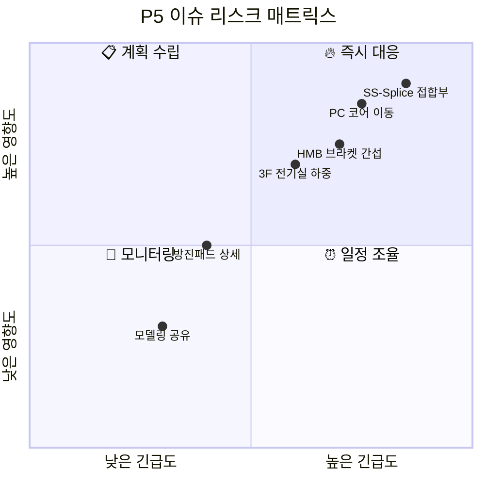

# 🎲 P5 리스크 매트릭스

## 📊 Impact × Urgency 매트릭스



---

## 🔥 Quadrant 1: 즉시 대응 (High Impact, High Urgency)

```dataview
TABLE WITHOUT ID
  link(file.link, title) as "이슈",
  owner as "담당자",
  due_date as "마감일"
FROM "P5-Project/01-Issues"
WHERE issue_id AND priority = "critical" AND issue_status != "closed"
SORT due_date ASC
LIMIT 10
```

## 📋 Quadrant 2: 계획 수립 (High Impact, Low Urgency)

```dataview
TABLE WITHOUT ID
  link(file.link, title) as "이슈",
  owner as "담당자",
  category as "카테고리"
FROM "P5-Project/01-Issues"
WHERE issue_id AND priority = "high" AND issue_status = "open"
SORT created_at DESC
LIMIT 10
```

## ⏰ Quadrant 4: 일정 조율 (Low Impact, High Urgency)

```dataview
TABLE WITHOUT ID
  link(file.link, title) as "이슈",
  due_date as "마감일"
FROM "P5-Project/01-Issues"
WHERE issue_id AND priority = "medium" AND due_date
SORT due_date ASC
LIMIT 10
```

## 👀 Quadrant 3: 모니터링 (Low Impact, Low Urgency)

```dataview
TABLE WITHOUT ID
  link(file.link, title) as "이슈",
  category as "카테고리"
FROM "P5-Project/01-Issues"
WHERE issue_id AND (priority = "low" OR priority = "normal")
SORT created_at DESC
LIMIT 5
```

---

## 📈 리스크 트렌드

### 이번 주 신규 Critical/High 이슈

```dataview
TABLE WITHOUT ID
  link(file.link, title) as "이슈",
  priority as "우선순위",
  owner as "담당자"
FROM "P5-Project/01-Issues"
WHERE issue_id AND (priority = "critical" OR priority = "high")
SORT created_at DESC
LIMIT 5
```

---

## 🏷️ 카테고리별 리스크 분포

```dataview
TABLE length(rows) as "건수"
FROM "P5-Project/01-Issues"
WHERE issue_id AND issue_status != "closed"
GROUP BY category as "카테고리"
SORT rows.length DESC
```

---

## ⚙️ 리스크 매트릭스 자동 생성

```bash
# 이슈 데이터 기반 매트릭스 갱신
python scripts/p5_risk_matrix.py generate

# 마크다운 출력
python scripts/p5_risk_matrix.py export --format mermaid
```
